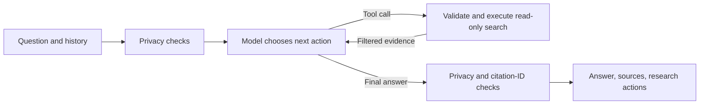
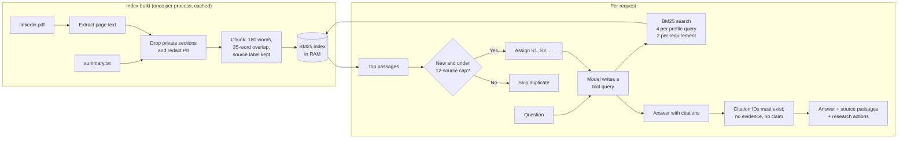

# Prasanna's Digital Twin

A conversational AI portfolio that answers questions about Prasanna Shrestha's
career, skills, and education. Visitors can ask about a particular
role, explore technical strengths, or compare a job description with documented
experience. The assistant identifies itself as AI and is instructed to admit
when the profile does not contain an answer.

Model responses use **Experiential Labs** at
`https://api.experientiallabs.ai/v1/chat/completions`, with **`gpt-5.6-luna`** as
the default model. OpenAI's Python client is used for protocol compatibility;
an OpenAI API key is not required.

## Is this agentic AI or RAG?

It is now a **bounded, tool-calling LangGraph agent with RAG**. The model chooses
which research tool to call, inspects the results, and can refine its searches
before answering. LangGraph controls the loop and enforces its boundaries.

The app does not need an agent framework for simple profile questions. The
agent is useful for multi-part questions and job-description comparisons that
need evidence from different parts of the profile. The tradeoff is more model
calls, latency, and cost than a fixed single-retrieval pipeline. It is not an
autonomous job applicant, web researcher, or multi-agent system.

The read-only tools are:

| Tool | Purpose |
| --- | --- |
| `search_profile` | Search the filtered career profile with a model-selected query; refine the query if needed. |
| `find_requirement_evidence` | Search separately for up to six job requirements and return candidate evidence for each. |

The requirement tool retrieves evidence; it does not verify qualifications or
assign a numeric fit score. The agent is instructed to distinguish supported,
partially supported, and not-documented requirements.



There are at most **three tool rounds**, **two executed tool calls per round**,
and **four model calls** per question. After the tool budget, the model is told
to stop calling tools. The graph rejects unknown tools and malformed arguments.
Source references must exist in the current request's evidence, and factual
answers without retrieved evidence are replaced with an abstention. Citation-ID
validation is not an LLM faithfulness evaluation: a real source can still be cited
for a claim it does not support.

### Retrieval and storage

1. Read `data/summary.txt` and extract text from `data/linkedin.pdf`; apply privacy filters.
2. Split text into passages of up to 180 words with 35-word overlap within longer
   sections, preserving source references.
3. Cache passages and a BM25 keyword index in the server process's RAM.
4. Search up to four passages per profile query or two per job requirement.
5. Accumulate at most 12 unique passages per request and return stable source IDs
   to the model. Display filtered passages and a short research-action list.



There is no embedding API, vector database, internet-search tool, or persistent
graph checkpoint. The model sees bounded chat history for follow-ups; research
state is fresh for each request. LangSmith tracing is explicitly disabled for
these runs. Restart the app to rebuild the index after document changes.

Keyword matching can miss synonyms. Tool autonomy does not guarantee better
answers, and generated claims still need review. This follows the distinction
between fixed workflows and model-directed agents in the
[LangGraph documentation](https://docs.langchain.com/oss/python/langgraph/workflows-agents).

## Features

- Document-grounded answers with inspectable source passages.
- Job-fit discussion that distinguishes documented experience from unknowns.
- Support for conversational follow-ups and Gradio text-block history.
- Privacy filtering at document ingestion, conversation input/history, and final output.
- Local refusal of private-detail requests and common raw-document extraction requests.
- Two read-only research tools, with strict execution budgets and no contact/notification tools.
- Expandable research-action list and request-local source identifiers.
- Clear messages for missing credentials, provider errors, and document failures.
- File paths relative to the app, so launch works from the repository root.
- Local and Render-compatible host/port settings.
- Modular package layout: retrieval, agent, UI, and config are separate modules.
- Offline retrieval evaluation with a committed baseline and regression check.
- Live agent behaviour eval for tool selection, abstention, citations, and refusals.

## Run locally

From the course repository root, install dependencies into your environment:

```bash
.venv/bin/python -m pip install -r 1_foundations/twin/requirements.txt
```

Set the following in your shell, `1_foundations/twin/.env`, or the repository
`.env`. Shell values take precedence; app-specific `.env` values take precedence
over the root `.env` for model configuration. Keep credentials out of Git.

```dotenv
EXPLABS_API_KEY=your_key_here
TWIN_MODEL=gpt-5.6-luna
TWIN_ENABLE_NOTIFICATIONS=false
```

Start the app:

```bash
.venv/bin/python 1_foundations/twin/app.py
```

Open **http://127.0.0.1:7861**. Port 7861 avoids the Deep Research app's default
7860 port. Set `PORT` to override it. Restart the app after changing documents
or environment settings so the cached index and settings are refreshed.

For a standalone checkout containing these files at the root, use
`pip install -r requirements.txt` and `python app.py` instead.

## Example questions

- What did you work on at his previous company?
- How did you improve fraud-risk service scalability?
- What experience do you have with Java, Kafka, and distributed systems?
- Compare your background with a backend role requiring Java and fraud prevention.
- What did you study, and which qualifications are confirmed?
- What experience do you have leading engineering teams?

## Profile maintenance

`data/summary.txt` contains an expanded narrative derived from the original
personal notes and `data/linkedin.pdf`. It covers employment history, technical skills,
education, a publication, and personal interests. The summary explicitly marks
current employment, availability, and placeholder certifications as unverified.
The PDF is a snapshot, not a live LinkedIn connection. Update both documents
when facts change and restart the app. Review the documents before deploying:
privacy-filtered passages are shown to visitors and sent to the model provider.
The original PDF and summary remain unchanged on disk and must not be published
if they contain information you do not want publicly accessible.

## Privacy guardrails

The public portfolio name and documented career history remain available. Private
contact details, residential addresses, birth dates, personal profile links, and
personal identifiers are excluded from answers through several checks:

1. `twin/privacy.py` redacts common email, phone, URL, street-address, birth-date,
   government-ID, and long numeric identifier formats before indexing passages.
   Personal biography, personal interests, and contact sections of the summary
   are excluded from retrieval entirely.
2. Common requests for private details or raw document dumps are refused locally,
   without calling the model. Encoded/obfuscated text is normalized before checks.
3. Visitor input and conversation history are redacted before model calls,
   including private data from earlier assistant responses.
4. The system prompt prohibits revealing, reconstructing, or encoding private data.
5. The final response and source excerpts are filtered together before display.
6. The graph only executes its two allowlisted retrieval tools. It does not offer
   or execute contact/notification tools, even if an old
   deployment still has `TWIN_ENABLE_NOTIFICATIONS=true`.

These are deterministic rules plus model instructions, not a guarantee that all
possible PII or adversarial encodings will be detected. Name and career history
are intentionally public. Review source documents and use a sanitized public
copy before hosting them in a public repository. Filtering the chat does not
redact files on disk, old conversations, browser caches, or previously published
Git history. Refresh and start a new chat after updating a running deployment.

`twin/legacy/notifications.py` contains retired notification helpers. They are
never registered with the agent, and the tool allowlist rejects those names.

## Render deployment

Use a Python web service. If deploying from the course repository, set the Root
Directory to `1_foundations/twin`; for a standalone repository leave it empty.

- Build command: `pip install -r requirements.txt`
- Start command: `python app.py`
- Environment: `EXPLABS_API_KEY`, optionally `TWIN_MODEL=gpt-5.6-luna`
- Notification tools are disabled by the application privacy policy.

The app uses `0.0.0.0` when `RENDER=true` and reads Render's `PORT`. Local runs
bind to `127.0.0.1`. API keys in your local environment do not transfer to Render.

## Project structure

```text
app.py                     Entry point for local runs, Spaces, and Render
data/                      Profile documents
  summary.txt              Curated personal and professional profile
  linkedin.pdf             Source career document
twin/
  config.py                Paths, model name, env loading, host/port
  privacy.py               Private-request detection and shared PII redaction
  provider.py              Experiential Labs chat client
  retrieval/
    knowledge_base.py      Passage dataclass and BM25 ranking
    loader.py              Ingestion, privacy filtering, chunking, cached index
  agent/
    graph.py               LangGraph tool loop, budgets, citation-ID validation
    tools.py               Tool schemas, allowlist, argument validation
    prompts.py             System prompt and agent instructions
  ui/
    interface.py           Chat entry point, history handling, evidence rendering
    styles.py              UI styling and example questions
  legacy/
    notifications.py       Retired helpers; never registered with the agent
tests/                     Offline regression suite
eval/
  run_retrieval_eval.py    Offline retrieval metrics (free)
  run_agent_eval.py        Live agent behaviour checks (costs model calls)
  cases/                   Case sets for both evals
  baselines/               Committed retrieval baseline
```

Everything behind `app.py` lives in the `twin` package, so the platform entry
point stays a thin launcher. `config.py` is the single place that resolves
document paths and model settings.

## Tests

Run the offline suite from this directory:

```bash
python -m unittest discover -s tests -t . -v
```

From the course repository root:

```bash
cd 1_foundations/twin && ../../.venv/bin/python -m unittest discover -s tests -t . -v
```

| Test file | Covers |
| --- | --- |
| `tests/test_retrieval.py` | BM25 ranking and index construction. |
| `tests/test_agent.py` | Tool selection, budgets, argument validation, request isolation. |
| `tests/test_ui.py` | History normalization, evidence rendering, input guards. |
| `tests/test_privacy.py` | Redaction formats, refusals, end-to-end filtering. |

The 22 offline tests use fake model responses with the real graph, covering
search refinement, job evidence gaps, invalid tools/arguments, loop budgets,
citation IDs, isolation between requests, and privacy regression cases. They do
not call the model provider or send notifications.

## Retrieval evaluation

`eval/` measures retrieval quality offline. It makes no provider calls, costs
nothing, and runs in under a second, so it is safe on every commit.

```bash
python eval/run_retrieval_eval.py                  # report
python eval/run_retrieval_eval.py --check          # fail on regression
python eval/run_retrieval_eval.py --write-baseline # record new metrics
```

The 30 cases in `eval/cases/retrieval_cases.jsonl` assert required substrings
rather than passage labels, because chunk labels such as
`summary.txt, section 7, passage 2` shift whenever the documents are edited.
Substrings survive re-chunking.

| Group | Cases | Purpose |
| --- | --- | --- |
| `direct` | 12 | Question wording close to the documents. |
| `synonym` | 8 | Deliberate paraphrase, to measure the keyword-matching gap. |
| `multihop` | 5 | Evidence needed from more than one passage. |
| `negative` | 5 | Out-of-scope probes that must retrieve nothing. |

Current baseline at k=4 (`eval/baselines/retrieval.json`):

| Group | hit@k | hit@1 | MRR |
| --- | --- | --- | --- |
| direct | 1.00 | 0.92 | 0.94 |
| synonym | 0.38 | 0.12 | 0.23 |
| multihop | 0.80 | 0.80 | 0.87 |
| negative | 1.00 | 1.00 | — |
| **all** | **0.80** | **0.70** | **0.58** |

The synonym row is the measured cost of lexical-only retrieval: queries such as
"container orchestration" do not reach the passage listing Kubernetes, and
"single sign-on" does not reach SSO. Closing that gap needs synonym expansion or
embeddings, neither of which is implemented. Run `--check` after editing
`data/summary.txt` or `data/linkedin.pdf`; re-chunking can change what is
retrievable without any code change.

Not covered by the retrieval eval: tool selection, abstention, and answer
phrasing. Those need a live model, and are covered below.

## Agent behaviour evaluation

`eval/run_agent_eval.py` runs 20 cases against the live provider and asserts
mechanical properties of the result. It costs real model calls, so it is a
manual step rather than a commit hook. Run it before a deploy, and after editing
`twin/agent/prompts.py` — prompt changes are exactly where behaviour regressions
hide, and the offline suite is blind to them by construction.

```bash
python eval/run_agent_eval.py --self-check        # free; verifies the harness
python eval/run_agent_eval.py                     # live; ~40 provider calls
python eval/run_agent_eval.py --group citation    # one group
```

| Group | Cases | Assertion |
| --- | --- | --- |
| `tool_selection` | 5 | Job comparisons call `find_requirement_evidence`; plain questions call `search_profile`. |
| `citation` | 6 | The answer cites a source that exists, and contains the expected documented fact. |
| `abstention` | 4 | Facts absent from the profile produce an acknowledged gap, not an answer. |
| `privacy` | 3 | Private requests return the refusal without reaching the provider. |
| `greeting` | 2 | No tool calls for a greeting. |

Every case also asserts the loop stayed within `MAX_TOOL_ROUNDS`.

The runner wraps the provider in a recorder, so it captures the tool names and
the queries the model wrote, without modifying the graph. Queries that retrieve
nothing are reported separately: a model rephrasing that retrieves worse than
the visitor's original wording is a real failure mode that the retrieval eval
cannot see.

`--self-check` substitutes a canned provider. It verifies the harness runs end to
end and costs nothing; its case outcomes are not an evaluation.

Each live run is saved to `eval/runs/` (gitignored) so a later faithfulness pass
can score the saved answers without paying for generation twice.

Still not covered: whether a cited passage actually supports the claim it is
attached to. Citation-ID validation confirms a source exists, not that it
supports the sentence. That needs a judge model reading each claim against its
cited passage, and is not implemented. A systematic LLM quality evaluation suite
with human-labelled answers is not included. The model provider has its own latency,
availability, and usage limits. Conversation history is used within the chat
session; this app does not implement a persistent conversation store or automated
verification of model-generated claims.
